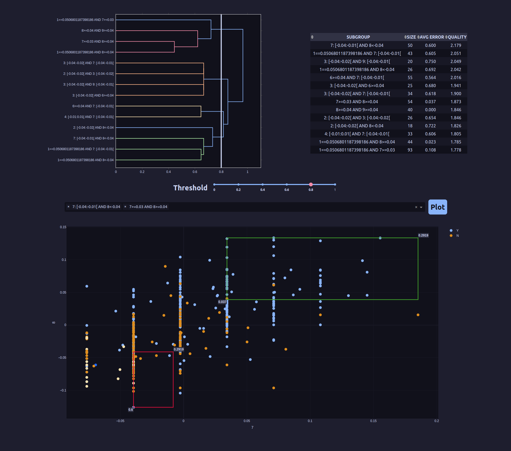

> Analyze Classification Models by highlighting regions where performance is abnormal

## Dependencies

Dependencies are managed with [`uv`](https://github.com/astral-sh/uv). Since it generates a `requirements.txt`, it should be compatible with other tools, like `pip`.

```bash
uv pip install -r requirements.txt
```

## Input

There are 4 parameters, 3 of which are required:

- A CSV containing the dataset.
- A CSV containing the model's errors. Each instance should have an error associated with each class. You can use a binary approach: if the prediction for a given instance is right, all of it's errors are zero. Otherwise, if the prediction is wrong, the all of it's errors are zero **except for the actual class**, which receives an error of one.
- The dataset's column that represents the output. By default, it's "target".
- A class from the dataset, to filter the subgroups for that specific class.
